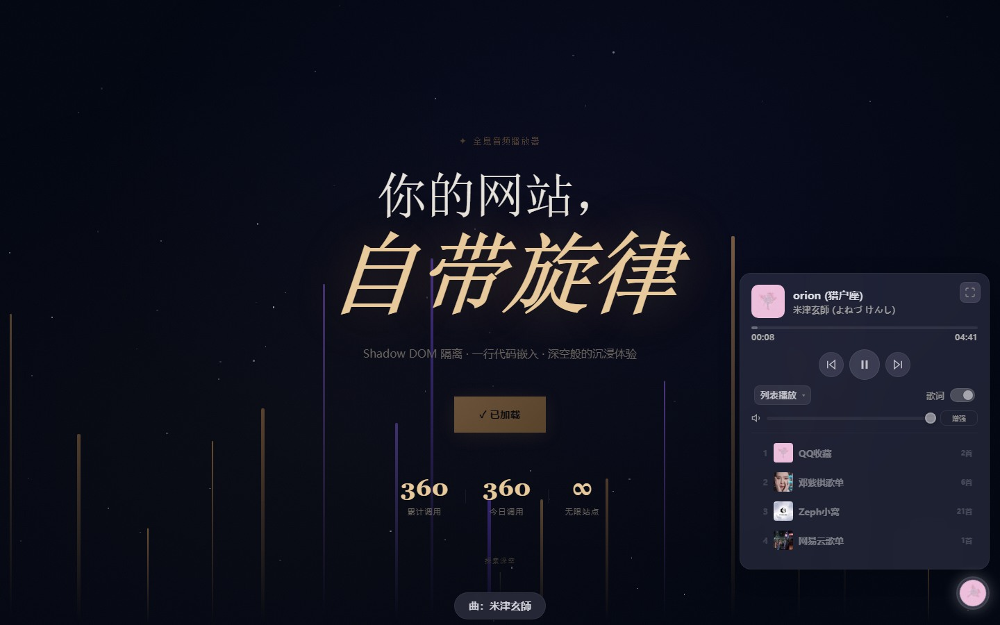
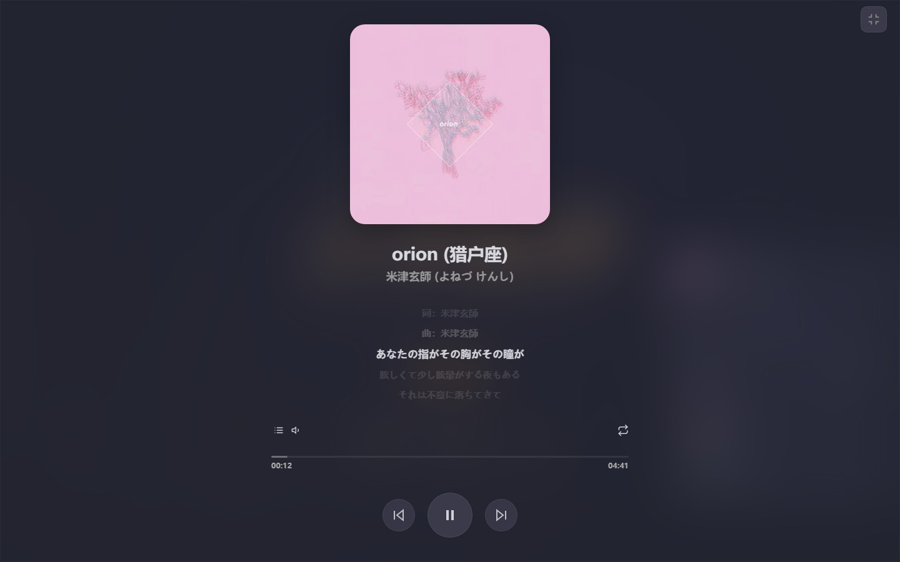
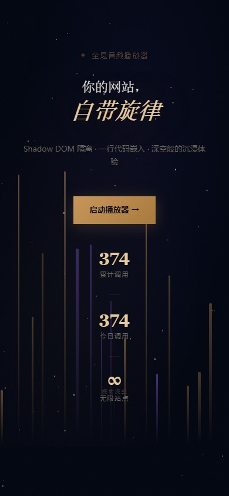
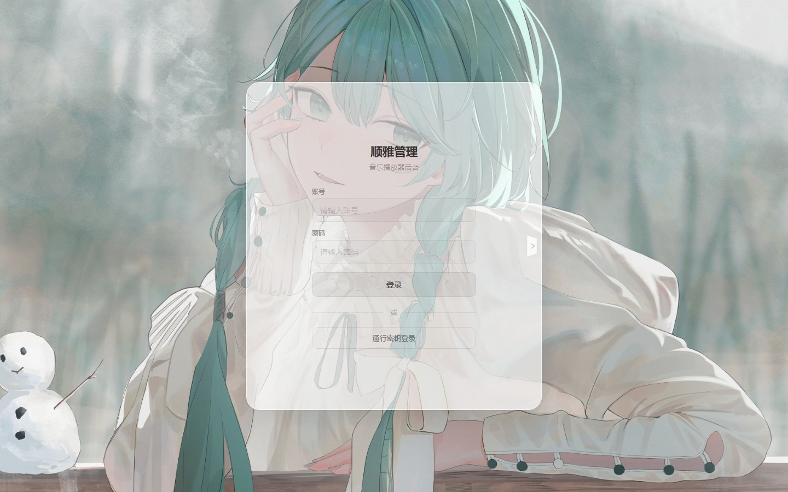

<div align="center">

# 顺雅 Shunya

**你的网站，自带旋律。**

基于 Shadow DOM 隔离的轻量级嵌入式音乐播放器 —— 一行 `<script>` 接入，与宿主页面零 CSS 冲突


[特性](#特性) · [界面预览](#界面预览) · [快速开始](#快速开始) · [使用方式](#使用方式) · [项目结构](#项目结构) · [API 端点](#api-端点)

</div>

---



## 特性

- **Shadow DOM 隔离** — 全部 UI 与样式封装在 `attachShadow({ mode: 'closed' })` 中，宿主页面的 CSS 无法穿透，零冲突嵌入任意网站。
- **一行嵌入** — 只需一行 `<script>`，播放器以悬浮音符按钮出现在页面右下角。
- **双音源** — 同时支持 QQ 音乐与网易云音乐歌单，一键切换。
- **歌词同步** — 实时解析 LRC 时间轴并逐行高亮，自动识别纯音乐。
- **沉浸模式** — 全屏播放，大尺寸封面、滚动歌词与完整控制栏。
- **暗色主题** — 按北京时间（18:00–06:00）自动切换深浅色，也可手动固定。
- **自由拖拽** — 悬浮按钮可拖至屏幕任意位置，松手自动吸附屏幕边缘。
- **音量增强** — 基于 Web Audio API 的三档增益：1× / 2× / 3×。
- **播放模式** — 列表循环、单曲循环、随机播放。
- **Cookie 持久化** — 跨会话记忆音量、歌单、播放进度与主题偏好。
- **隐私合规** — 内置 Cookie 授权弹窗，用户明确同意后才写入数据。
- **管理后台** — 在 `/admin/` 中管理 API 密钥、歌单、公告与调用统计。

---

## 界面预览

### 落地页

站点首页「顺雅 · 声波宇宙」，深空暗色主题，实时展示接口调用统计。


### 播放器面板

悬浮按钮展开后的控制面板：封面、进度、播放模式、歌词开关、音量增强与歌单列表。


### 沉浸模式

全屏大封面配合滚动歌词，宛如原生播放器。



### 移动端

面板在移动端自动收窄，触控拖拽与边缘吸附保持一致。

<p align="center">
  
</p>

### 管理后台

`/admin/` 后台登录页，支持账号密码与 WebAuthn 通行密钥两种登录方式。



---

## 快速开始

### 环境要求

| 组件       | 最低版本                        |
|------------|---------------------------------|
| PHP        | 8.5+                            |
| 数据库     | MySQL 5.7+ 或 SQLite 3          |
| Web 服务器 | Apache / Nginx / PHP 内置服务器 |

### 安装步骤

1. 将项目**克隆或解压**到 Web 服务器目录（如 `/var/www/msapi` 或 `C:\xampp\htdocs\msapi`）。
2. 将 Web 服务器的站点根**指向**项目目录。
3. 浏览器访问 `/install/`，安装向导会引导完成：
   - 数据库配置（MySQL 或 SQLite）
   - 管理员账户创建
   - 初始 API 密钥设置
4. 安装完成后，建议**删除或限制** `/install/` 目录的访问权限。

> 如果 `config/config.php` 已存在且配置正确，安装程序会自动跳过。

### PHP 内置服务器（快速测试）

```bash
php -S 127.0.0.1:8080 -t /path/to/Msapi
```

然后打开 `http://127.0.0.1:8080/install/` 开始配置。

---

## 使用方式

### 嵌入播放器

在任意页面的 `</body>` 之前添加一行 `<script>`：

```html
<script src="https://your-domain.com/modules/api.php?route=router" key="YOUR_API_KEY"></script>
```

播放器随即以悬浮按钮出现在页面右下角，点击展开控制面板。所有访客无需注册即可收听。

### 自定义参数

嵌入脚本支持在 `<script>` 标签上设置以下属性：

| 属性               | 说明                             | 默认值       |
|--------------------|----------------------------------|--------------|
| `key`              | API 密钥（必填）                 | —            |
| `token`            | 预验证的授权令牌（跳过密钥校验） | —            |
| `api`              | 自定义 API 端点 URL              | 自动检测     |
| `cdn-aplayer-css`  | 自定义 APlayer 样式地址          | jsDelivr CDN |
| `cdn-aplayer-js`   | 自定义 APlayer 脚本地址          | jsDelivr CDN |

### 通过管理后台配置

登录 `/admin/` 后可配置以下项：

- **歌单** — 添加 QQ 音乐或网易云音乐歌单
- **主题** — 自动（按时间）或强制浅色 / 深色
- **自动播放** — 页面加载时是否自动播放
- **歌词** — 默认歌词显示开关
- **服务器** — 默认音乐源（腾讯 / 网易）
- **公告** — 向所有嵌入播放器推送广播消息

---

## 项目结构

```
Msapi/
├── index.php                  # 落地页（顺雅 · 声波宇宙）
├── favicon.ico
├── LICENSE                    # MIT
├── config/
│   └── config.php             # 数据库与站点配置（安装向导生成）
├── modules/                   # 播放器前端
│   ├── api.php                # JS 路由分发器（?route=router / ?route=chiropractic）
│   ├── router/                # 模块化播放器
│   │   ├── auth.js            # 密钥校验与 Cookie 授权
│   │   ├── widget.js          # 悬浮组件、样式与 Shadow DOM 挂载
│   │   ├── state.js           # 状态与 Cookie 持久化
│   │   ├── player.js          # APlayer 播放内核
│   │   ├── ui.js              # 面板渲染与交互
│   │   ├── drag.js            # 拖拽与边缘吸附
│   │   ├── immersive.js       # 沉浸全屏模式
│   │   ├── lyrics.js          # LRC 解析与歌词同步
│   │   └── theme.js           # 主题、公告与问候
│   └── chiropractic/
│       └── embed.js           # 旧版单文件播放器
├── assets/
│   ├── css/                   # 落地页样式（pc / mobile）
│   ├── js/                    # 落地页交互（pc / mobile）
│   └── lib/
│       ├── api_config.php     # API 配置读取
│       ├── db.php             # 数据库抽象层（MySQL / SQLite）
│       ├── helpers.php        # 通用工具函数
│       ├── jwt.php            # HS256 JWT 签发与校验
│       └── widget.php         # 第三方页面嵌入脚本
├── admin/                     # 管理后台（单入口）
│   ├── index.php              # 后台入口
│   ├── api/                   # api.php / qq_api.php / wy_api.php / relay.php
│   ├── assets/                # pc / mobile 两套资源与 CodeMirror
│   ├── handlers/              # 各功能处理端点
│   ├── includes/              # bootstrap / guard / routes / user_init
│   ├── layout/                # header / footer
│   ├── lib/                   # auth / mail / pusher / s3 / webauthn / cover_cache
│   └── pages/                 # 页面视图
├── install/                   # 安装向导
│   ├── index.php              # 向导入口
│   ├── init.php               # 安装逻辑
│   ├── upgrade.php            # 数据库迁移
│   ├── handlers/ includes/ lib/
│   └── sql/                   # mysql.sql / sqlite.sql
└── docs/images/               # README 截图
```

---

## API 端点

| 端点                                         | 方法 | 说明                                             |
|----------------------------------------------|------|--------------------------------------------------|
| `/admin/api/api.php?action=verify-key`       | POST | 校验 API 密钥，返回 Token                        |
| `/admin/api/api.php?action=get-config`       | GET  | 获取歌单与主题配置                               |
| `/admin/api/api.php?action=get-announcement` | GET  | 获取当前公告                                     |
| `/admin/api/api.php?action=playlist`         | GET  | 获取歌单歌曲（参数：`id`、`server`、`limit`）    |

---

## 技术栈

- **前端**：原生 JavaScript（ES5+）、Shadow DOM、APlayer 1.10.1
- **后端**：PHP、MySQL / SQLite
- **音乐 API**：QQ 音乐与网易云音乐代理转发
- **CDN 依赖**：APlayer CSS 与 JS 通过 jsDelivr 加载

---

## 开源许可

[MIT](LICENSE) © 2026 Freewind72

---

<div align="center">

*献给每一张值得拥有背景音乐的网页。*

</div>
